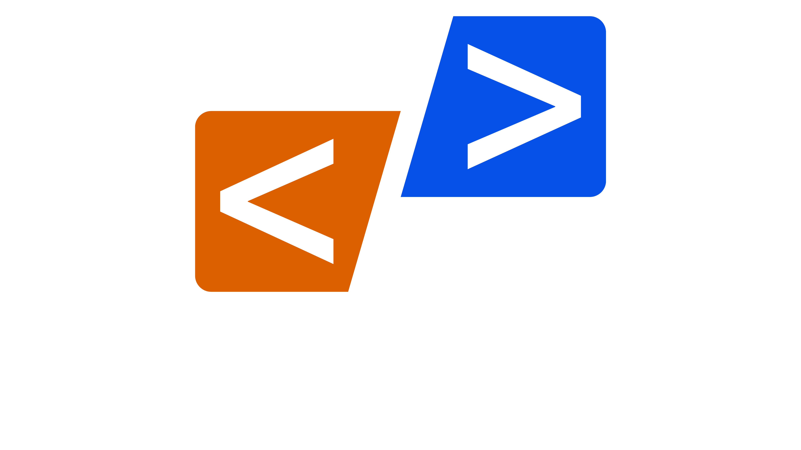

<a name="readme-top">

 

 

  <a href="https://github.com/Tnarg27/">
  <!-- TODO: If you want to add logo or banner you can add it here -->
    
  </a>
<!-- TODO: Change Title to the name of the title of your Project -->
  <h3 align="center">T-NARG - Player Leaderboard Platform</h3>

<!-- TODO: Make a short description -->

  T-NARG is an interactive Player Leaderboard System designed to display and manage player scores, levels, and other related data. Users can view rankings, track player performance, and sort the leaderboard based on various criteria such as score, level, or name. The platform provides a clean and simple user interface for easy navigation and management of player data.

 

<!-- TODO: Change the zyx-0314 into your github username  -->
<!-- TODO: Change the WD-Template-Project into the same name of your folder -->

---

 

---

## Overview

<!-- TODO: To be changed -->
<!-- The following are just sample -->
Player Leaderboard System

Guiding Question:
- **What is the project?** 
T-NARG is a leaderboard platform that tracks and displays player data like score, level, and ranking. It allows users to easily sort and filter player performance data by various criteria.

- **Whats the purpose** 
The purpose of the platform is to offer a competitive environment where players' performances can be compared, sorted, and tracked. It provides an easy-to-use interface to view rankings, identify top performers, and organize competitions.

- **What are key components**  
Player Management: Stores and displays details of players, including their name, score, and level.  
Leaderboard Interface: Ranks players dynamically, allowing for easy sorting by different criteria.  
Sorting and Filtering: Sorting options for score, level, or player name to customize the leaderboard view.   
Interactive Features: Updates the leaderboard in real-time when sorting or filtering criteria are changed.   
Statistics Page: Displays detailed statistics such as top players, average scores, and level distribution.   

- **What technology used and how it is used**  
  HTML: Used for structuring the webpage and defining elements like the leaderboard table, header, footer, and navigation controls.  
  CSS: Applied for styling the page, ensuring a clean, visually appealing layout. CSS is used for spacing, color themes, and responsive design to adapt to different screen sizes.  
  JavaScript: The core of the project. JavaScript is used to dynamically render the leaderboard and enable sorting functionality. It allows for real-time updates of player rankings based on user input.

### Key Components
<!-- TODO: List of Key Components -->
<!-- The following are just sample -->
- MultiPage Website
- Parallax transition
- Transactional

### Technology
<!-- TODO: List of Technology Used -->

